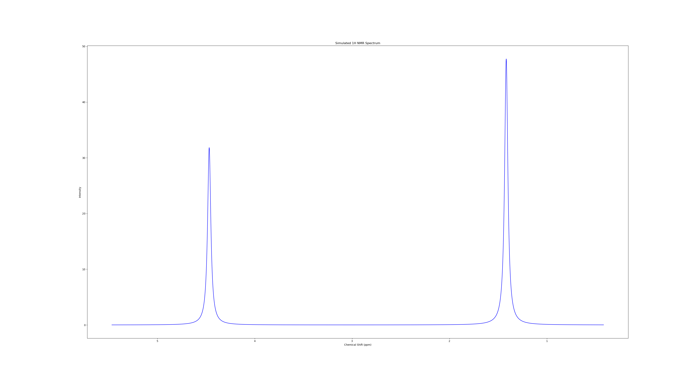

# AutoNMR-An-Automated-Tool-for-NMR-Chemical-Shift-Calculations-using-NWChem
## Introduction
AutoNMR is a novel Python package designed to streamline and automate the workflow of NMR chemical shift calculations using NWChem. By accepting a molecular structure in the form of a SMILES code, AutoNMR automates the processes of structure generation, conformer generation, geometry optimization, frequency calculations, free energy calculations, and NMR shielding tensor calculations. This package also incorporates Boltzmann weighting to provide accurate chemical shift predictions.
## Methodology
AutoNMR Tool performs all the calclutions using NWChem. Below is the sequence wise algorithm which has been implemented in the tool to give the better results on the automation process.
### Structure & Conformer Generation

AutoNMR uses RDKit to convert the SMILES code into a 3D molecular structure. Conformers are generated using RDKit's ETKDG method, which efficiently samples the conformational space of the molecule. Multiple conformers are generated to ensure comprehensive sampling.

### Generates NWChem Input File

NWChem input file (.nw) is generated for each conformer for geometry optimization, frequency calculations, and shielding tensor calculations using DFT. The sample input file can be seen in the GitHub repository for NMR chemical shift calculations.

### NMR Shielding Tensor Calculation

The NWChem input file for each conformer runs on the terminal for generating the output file for each conformer, which contains information about the shielding tensor values and thermodynamic values useful for further calculations. Necessary information is extracted from the output files of each conformer.

### Free Energy Calculation

The free energy of each conformer is calculated from the vibrational frequencies and the electronic energy obtained from geometry optimization. These free energies are essential for Boltzmann weighting. These free energy values for each conformer are used to determine the Boltzmann weight.

### Boltzmann Weighting

Boltzmann weighting is applied to the calculated shielding tensors based on the free energy of each conformer. This step accounts for the population distribution of different conformers. This concept results in the Boltzmann weighted shielding tensor value for each atom of the molecule.

### Chemical Shift Calculation

The Boltzmann weighted shielding tensor values are averaged to get the cluster midpoint values of hydrogen within the same environment. These values are then used with the Linear Regression Model to get the exact chemical shift value.

### Scaling using Linear Regression

Running the test on molecules and comparing it with the experimental known chemical shift values builds a linear regression model with the same functionals and DFT specifications. Use the intercept and the slope obtained to scale the computational calculated value of shielding tensors.

### NMR Spectrum

The scaled values of chemical shifts are then extracted to plot the NMR spectrum using the Lorentzian function. The concept of J-Coupling and Pascal’s ratio for the intensity of peaks are also included to determine a relevant spectrum.

## Requirements
The following are the requirements to run the AutoNMR package:

### Operating System
AutoNMR has been tested on the following operating systems:
- **Linux**: Preferred due to better support for NWChem and scientific computing.
- **macOS**: Compatible, but ensure NWChem is properly configured.
- **Windows**: Can be used with appropriate configuration, but might require additional setup for NWChem.
### Software
- **Python**: Ensure you have Python installed. AutoNMR is compatible with Python 3.6 and above.
- **NWChem**: NWChem must be installed and properly configured on your system to perform quantum chemical calculations.
- **Python Distribution**: The following Python distribuiton are required:
  - **Anaconda 4.3**: It is recommended to use Anaconda for managing the Python environment and dependencies. Anaconda includes many of the necessary packages and makes installation easier.
  - **RDKit 2024.03.5**: RDKit is important tool required for building 3D structure and generating conformers of the molecule. The installation guide of RDKit can be referred [here](https://www.rdkit.org/docs/Install.html)
  
Additional packages that need to be installed can be found in the `requirements.txt` file provided in the repository.
## Installation Guide for NWChem
The following tutorial provides instructions for installing NWChem on Linux. If you are using a different operating system, such as Windows or macOS, please visit the [NWChem website](https://nwchemgit.github.io/Download.html#nwchem-availability-in-linux-distributions) for specific instructions tailored to your OS.
### Installation Steps
1. **Open the terminal.**

2. **Update your package list by running the following command:**

    ```sh
    sudo apt update
    ```

3. **Install NWChem by running the following command:**

    ```sh
    sudo apt install nwchem
    ```

4. **Verify the installation by running the following command to check the NWChem command is available in your system's PATH**
    ```sh
    command -v nwchem
    ```

    If NWChem is installed and properly configured, these commands will return the path to the nwchem executable. If NWChem is not installed or not in your PATH, these commands will not return any output.

Congratulations! You have successfully installed NWChem on your system.
## Usage of AutoNMR - A Case Study of 2-Chloropropene
### Brief Introduction
Let's begin to understand how to use AutoNMR tool step-by-step for getting the NMR Chemical Shifts and the NMR Spectrum of the respective atoms.Here we have taken the example of **2-Chloropropene** whose canonical smiles code is `CC(=C)Cl`

The AutoNMR tool contains four important python script which can be downlaoded from this repository. The scripts are mentioned below:

1. [**AutoNMR.py**](AutoNMR.py)- This script performs all the task related to NMR Shift calculation using NWChem. This returns the boltzmann calculated shielding tensor values of atoms for further study. Further details regarding the script can be found later in this tutorial.
2. [**Linear_Regression.py**](Linear_Regression.py) - This script perfoms linear regression calclution on a set of data ( Experimental and calculated ) to build a model which returns the slope and intercept required to scale the shielding tensor values obtained from [**AutoNMR.py**](AutoNMR.py).
3. [**Scaling.py**](Scaling.py)- This script gives the final calculated NMR Chemcial shift values after scaling the resulted output of shielding tensor values obtained from [**AutoNMR.py**](AutoNMR.py) using the slope and the intercept values obtained from [**Linear_Regression.py**](Linear_Regression.py).
4. [**NMR_Simulation.py**](NMR_Simulation.py) - This script gives you the NMR Spectrum of the resultant chemical shift obtained from the [**Scaling.py**](Scaling.py).

After Downloading these script create a working directory where you can save all these script together, say `AutoNMR` which contains all the four script mentioned above.

## Beiginning with [**AutoNMR.py**](AutoNMR.py) - First Step
This script performs the following task using NWChem module : 
- Structure and Conformer Generation
- Generates NWChem Input File
- NMR Shielding Tensor Calculation
- Free Energy Calculation
- Boltzmann Weighting
- Returns the Boltzmann weighted shielding tensor values

`**Step 1:**` Navigate the terminal to the working directory say `AutoNMR` which contains all these files.

`**Step 2:**` Get the canonical smiles of the molecule here the example is of **2-Chloropropene** whose canonical smiles code is `CC(=C)Cl`

`**Step 3:**` Run the following command on the terminal.
```
python3 AutoNMR.py "CC(=C)Cl" "B3LYP" --num_conformers 10 --case 1
```
Now here the smiles code is take for example is `CC(=C)Cl` and the DFT level functional used in the calculation is `B3LYP` you may also use other DFT level functionals as available in the [NWChem Documentation](https://nwchemgit.github.io/Density-Functional-Theory-for-Molecules.html) 

The `num_conformers` which describes the number of conformers the user wants to consider for studying the resepective molecule whose default value is 10.

The last command line argument `case` explains that which spectrum user wants to study in the respective molecule. It is **1 for Hydrogen spectrum** and **6 for carbon spectrum** so it calculates the shielding tensor values of the specified atoms in the molecule.

`**Note**`

Here the calcultion are performed on No. of processors = 40. In case your machine is compatible with less or more number of processor you need to mention the number of processors in the **line 439** of the script  [**AutoNMR.py**](AutoNMR.py) ` np < No. of Processor , by default it is 40 > `

`**Step 4:**` The terminal shows that NWChem Calculation is running one by one for each of the conformer and after the calculation is over , open the working directory here `AutoNMR` to see the files obtained after calculation. 

- Open the filename `chemical_shifts.xlsx`. For example for the molecule 2-chloropropene the file `chemical_shifts.xlsx` is :

  
| Atom | Shielding Tensor |
|------|------------------|
| H5   | 27.1085447911423 |
| H3   | 30.564995548431  |
| H2   | 30.3950244022379 |
| H1   | 30.4804359376167 |
| H4   | 27.1786016800279 |

These are the values of the shielding tensors of each of the hydrogen atoms of the molecule 2-chloropropene. Now you have to calculate the cluster midpoint values (Average Tensor Values) of the hydrogen atoms of this molecule which is under same environment.
In 2-chloropropene whose smiles code is `CC(=C)Cl` there are two hydrogen environment here one is **3-hydrogens of methyl group** and other is **2-hydrogens of the double bonded sp2 carbon**. You can see the structure below:

The `H1 H2 and H3` are in same environment and `H4 and H5` are in similar environment as they have almost the similar values of shielding tensor. Now calcluate the average shielding tensor value for `H1 H2 and H3` and similarly for `H4 and H5` and edit the `chemical_shifts.xlsx` file.

The preview of the edited file is shown  below:

| Atom | Shielding Tensor   | Atoms     | Average Tensor    |
|------|--------------------|-----------|-------------------|
| H5   | 27.1085447911423   | H1 H2 H3  | 30.4801519627618  |
| H3   | 30.564995548431    | H4 H5     | 27.1435732355851  |
| H2   | 30.3950244022379   |           |                   |
| H1   | 30.4804359376167   |           |                   |
| H4   | 27.1786016800279   |           |                   |

Just save the `chemical_shifts.xlsx` file and close it. Let's now move to the next script.

## [**Linear_Regression.py**](Linear_Regression.py) and [**Scaling.py**](Scaling.py) - Second Step
As mentioned earlier,[**Linear_Regression.py**](Linear_Regression.py) script is designed to be executed once on the entire dataset. This script performs calculations at a consistent level of theory to create a model that provides the slope and intercept values. These values are then used to reference the average shielding tensor value calculated above. You can create your own data set based on the experimental value and the calculated value of shielding tensor which can be obtained from above descirbed calculation steps. 

Here is a preview of the data set  [`data.xlsx`](data.xlsx)  file :

| shift | tensor  |
|-------|---------|
| 5.28  | 26.1331 |
| 7.21  | 23.9118 |
| 3.5   | 28.2132 |
| 4.22  | 27.4418 |
| 3.6   | 28.0525 |
| 1.5   | 30.4292 |
| 2.7   | 29.0756 |
| 1.55  | 30.4677 |
| 4.4   | 27.304  |
| 0.54  | 31.392  |
| 5.5   | 26.0877 |
| 6.36  | 25.0357 |
| 6.49  | 25.0536 |
| 9.69  | 21.5336 |
| 2.12  | 29.6074 |
| 2.54  | 29.2436 |

Here the `shift` is the experimental shift values and the `tensor` is the calculated tensor values of the atoms on same level of theory.

`**Step 1:**` Once the dataset is ready, save it in `data.xlsx` file in the working directory (here `AutoNMR`) and then run the following command on the terminal.

```
python3 Linear_Regression.py

```
This returns the slope and the intercept value required for scaling the average tensor values to get the exact chemical shift value of the atoms. Open the file `data.xlsx` and a new sheet `Regression_Results` will be generated in `data.xlsx` file. This contains the value of slope and intercept required in next step. 

The preview of the slope and intercept value is shown below:

| Parameter | Value              |
|-----------|--------------------|
| Slope     | -1.09373905411539  |
| Intercept | 32.0301102772846   |

**Step 2:** Using this slope and intercept obtained above, Now run the following command on the terminal. The accuracy of this slope and intercept value is cruical step for determining the accurate chemical shift values of atoms.
```
python3 Scaling.py --slope -1.0937391 --intercept 32.0301103

```
Here the Command line argument `slope` is he value of the slope of your linear regression model and the `intercept` is the intercept value obtained from you linear regression model.

After running this command , open the `chemical_shifts.xlsx` file and the shift values for the respective hydrogen environment of **2-chloropropene** can be seen.

The Preview of the [`chemical_shifts.xlsx`](2-Chloropropene/chemical_shifts.xlsx) file is shown below:

| Atom | Shielding Tensor   | Atoms     | Average Tensor    | Shift Values          |
|------|--------------------|-----------|-------------------|-----------------------|
| H5   | 27.1085447911423   | H1 H2 H3  | 30.4801519627618  | 1.41711888807687       |
| H3   | 30.564995548431    | H4 H5     | 27.1435732355851  | 4.46773555449823       |
| H2   | 30.3950244022379   |           |                   |                       |
| H1   | 30.4804359376167   |           |                   |                       |
| H4   | 27.1786016800279   |           |                   |                       |

Here is the cluster midpoint shift values of the two hydrogen environments present in **2-chloropropene**. Thus this is the final result obtained from the calculations.

## [**NMR_Simulation.py**](NMR_Simulation.py) - Final Step 

Since now we have obtained the value of the NMR Chemical Shifts of each of the hydrogen environments , wer can get the NMR Spectrum plot of the molecule.

Run the following command on the terminal to get the 1H NMR Spectrum of 2-chloropropene
```
python3 NMR_Simulation.py "CC(=C)Cl"
```
( Here the Value of J-coupling is 7.0 and the spectrometer frequency considered in the calculation is 90000000 Hz. )

The Preview of the spectrum obtained can be seen below:



## References 

1. E. Aprà, E. J. Bylaska, W. A. de Jong, N. Govind, K. Kowalski, T. P. Straatsma, M. Valiev, H. J. J. van Dam, Y. Alexeev, J. Anchell, V. Anisimov, F. W. Aquino, R. Atta-Fynn, J. Autschbach, N. P. Bauman, J. C. Becca, D. E. Bernholdt, K. Bhaskaran-Nair, S. Bogatko, P. Borowski, J. Boschen, J. Brabec, A. Bruner, E. Cauët, Y. Chen, G. N. Chuev, C. J. Cramer, J. Daily, M. J. O. Deegan, T. H. Dunning Jr., M. Dupuis, K. G. Dyall, G. I. Fann, S. A. Fischer, A. Fonari, H. Früchtl, L. Gagliardi, J. Garza, N. Gawande, S. Ghosh, K. Glaesemann, A. W. Götz, J. Hammond, V. Helms, E. D. Hermes, K. Hirao, S. Hirata, M. Jacquelin, L. Jensen, B. G. Johnson, H. Jónsson, R. A. Kendall, M. Klemm, R. Kobayashi, V. Konkov, S. Krishnamoorthy, M. Krishnan, Z. Lin, R. D. Lins, R. J. Littlefield, A. J. Logsdail, K. Lopata, W. Ma, A. V. Marenich, J. Martin del Campo, D. Mejia-Rodriguez, J. E. Moore, J. M. Mullin, T. Nakajima, D. R. Nascimento, J. A. Nichols, P. J. Nichols, J. Nieplocha, A. Otero-de-la-Roza, B. Palmer, A. Panyala, T. Pirojsirikul, B. Peng, R. Peverati, J. Pittner, L. Pollack, R. M. Richard, P. Sadayappan, G. C. Schatz, W. A. Shelton, D. W. Silverstein, D. M. A. Smith, T. A. Soares, D. Song, M. Swart, H. L. Taylor, G. S. Thomas, V. Tipparaju, D. G. Truhlar, K. Tsemekhman, T. Van Voorhis, Á. Vázquez-Mayagoitia, P. Verma, O. Villa, A. Vishnu, K. D. Vogiatzis, D. Wang, J. H. Weare, M. J. Williamson, T. L. Windus, K. Woliński, A. T. Wong, Q. Wu, C. Yang, Q. Yu, M. Zacharias, Z. Zhang, Y. Zhao, and R. J. Harrison, “NWChem: Past, present, and future”, The Journal of Chemical Physics 152, 184102 (2020). DOI: ([10.1063/5.0004997](https://doi.org/10.1063/5.0004997))

2. Van Rossum, G., & Drake, F. L. (2009). Python 3 Reference Manual. Scotts Valley, CA: CreateSpace.

3. Willoughby, P. H.; Jansma, M. J.; Hoye, T. R. A Guide to Small-Molecule Structure Assignment through Computation of (1H and 13C) NMR Chemical Shifts. Nature protocols 2014, 9 (3), 643–660. [doi.org/10.1038/nprot.2014.042.](https://doi.org/10.1038/nprot.2014.042.)

4. Anaconda Software Distribution. (2020). Anaconda Documentation. Anaconda Inc. Retrieved from https://docs.anaconda.com/

5. RDKit: Open-source cheminformatics. https://www.rdkit.org

6. O'Boyle, N.M., Banck, M., James, C.A. et al. Open Babel: An open chemical toolbox. J Cheminform 3, 33 (2011). https://doi.org/10.1186/1758-2946-3-33


 


  


